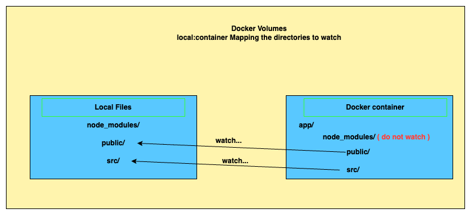

## Dockerize the app
- `Dockerfile.dev` - run in dev mode
- `Dockerfile.prod` - run in production/deployed

## in Development
Creating `Dockerfile.dev`

```Dockerfile
FROM node:18-alpine

WORKDIR /app

COPY package.json .
RUN npm install

COPY . .

CMD [ "npm", "run", "start" ]
```

1. `rm -rf node_modules`
2. `docker build -t sbasangovs/react-app -f Dockerfile.dev`
3. `docker run -p 3000:3000 sbasangovs/react-app`

## How to make our Container automatically 'hot reload' reflectiong our local source code changes ?
### Use docker volumes



#### command to run:
1. `rm -rf node_modules`
2. `docker build -t sbasangovs/react-app -f Dockerfile.dev`
3. `docker run -p 3000:3000 -v /app/node_modules -v $(pwd):/app sbasangovs/react-app`

#### Explaination:
- `-v /app/node_modules` - do not map the image's `node-modules/`
- `-v $(pwd):/app` - map pesent working directory to the image's /app (except `node-modules/`)

### Use docker volumes with docker-compose

- create `docker-compose.yml`

```yml
version: '3'
services:
  react-app:
    build:
      context: .
      dockerfile: Dockerfile.dev
    ports:
      - "3000:3000"
    volumes:
      - /app/node_modules
      - .:/app
```

#### Explaination:
- `build: > context: .`- build context current working dir
- `build: > context: . > dockerfile: Dockerfile.dev` - dockerfile to build image is in current working directory filename `Dockerfile.dev`
- `- /app/node_modules` -  bookmark `node-modules/`, do not map the image's `node-modules/`
- `- .:/app` - map pesent working directory to the image's /app (except `node-modules/`)

#### command to run:
`docker-compose up`

### Running tests
`docker run -it sbasangovs/react-app npm run test`

### Running tests hot reload
### Approach 1:
#### Terminal /Tab 1: 
- `docker-compose up`
#### Terminal /Tab 2: 
- `docker-compose up`
- `docker exec -it <container ID> npm run test`

### Approach 2:
#### Add a test container to `docker-compose.yml`
```yml
version: '3'
services:
  react-app:
    build:
      context: .
      dockerfile: Dockerfile.dev
    ports:
      - "3000:3000"
    volumes:
      - /app/node_modules
      - .:/app
  tests:
    build:
      context: .
      dockerfile: Dockerfile.dev
    volumes:
      - /app/node_modules
      - .:/app
    command: ["npm", "run", "test"]
```
- `docker-compose up --build` it will run the both containers `react-app and` and `test`, the `test` container
will run in hot-reload mode

# Getting Started with Create React App

This project was bootstrapped with [Create React App](https://github.com/facebook/create-react-app).

## Available Scripts

In the project directory, you can run:

### `npm start`

Runs the app in the development mode.\
Open [http://localhost:3000](http://localhost:3000) to view it in your browser.

The page will reload when you make changes.\
You may also see any lint errors in the console.

### `npm test`

Launches the test runner in the interactive watch mode.\
See the section about [running tests](https://facebook.github.io/create-react-app/docs/running-tests) for more information.

### `npm run build`

Builds the app for production to the `build` folder.\
It correctly bundles React in production mode and optimizes the build for the best performance.

The build is minified and the filenames include the hashes.\
Your app is ready to be deployed!

See the section about [deployment](https://facebook.github.io/create-react-app/docs/deployment) for more information.

### `npm run eject`

**Note: this is a one-way operation. Once you `eject`, you can't go back!**

If you aren't satisfied with the build tool and configuration choices, you can `eject` at any time. This command will remove the single build dependency from your project.

Instead, it will copy all the configuration files and the transitive dependencies (webpack, Babel, ESLint, etc) right into your project so you have full control over them. All of the commands except `eject` will still work, but they will point to the copied scripts so you can tweak them. At this point you're on your own.

You don't have to ever use `eject`. The curated feature set is suitable for small and middle deployments, and you shouldn't feel obligated to use this feature. However we understand that this tool wouldn't be useful if you couldn't customize it when you are ready for it.

## Learn More

You can learn more in the [Create React App documentation](https://facebook.github.io/create-react-app/docs/getting-started).

To learn React, check out the [React documentation](https://reactjs.org/).

### Code Splitting

This section has moved here: [https://facebook.github.io/create-react-app/docs/code-splitting](https://facebook.github.io/create-react-app/docs/code-splitting)

### Analyzing the Bundle Size

This section has moved here: [https://facebook.github.io/create-react-app/docs/analyzing-the-bundle-size](https://facebook.github.io/create-react-app/docs/analyzing-the-bundle-size)

### Making a Progressive Web App

This section has moved here: [https://facebook.github.io/create-react-app/docs/making-a-progressive-web-app](https://facebook.github.io/create-react-app/docs/making-a-progressive-web-app)

### Advanced Configuration

This section has moved here: [https://facebook.github.io/create-react-app/docs/advanced-configuration](https://facebook.github.io/create-react-app/docs/advanced-configuration)

### Deployment

This section has moved here: [https://facebook.github.io/create-react-app/docs/deployment](https://facebook.github.io/create-react-app/docs/deployment)

### `npm run build` fails to minify

This section has moved here: [https://facebook.github.io/create-react-app/docs/troubleshooting#npm-run-build-fails-to-minify](https://facebook.github.io/create-react-app/docs/troubleshooting#npm-run-build-fails-to-minify)
